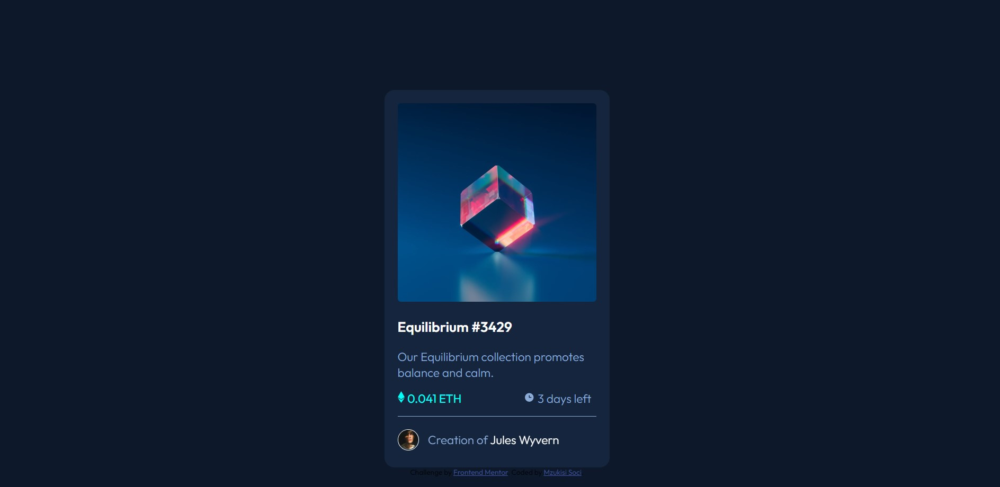
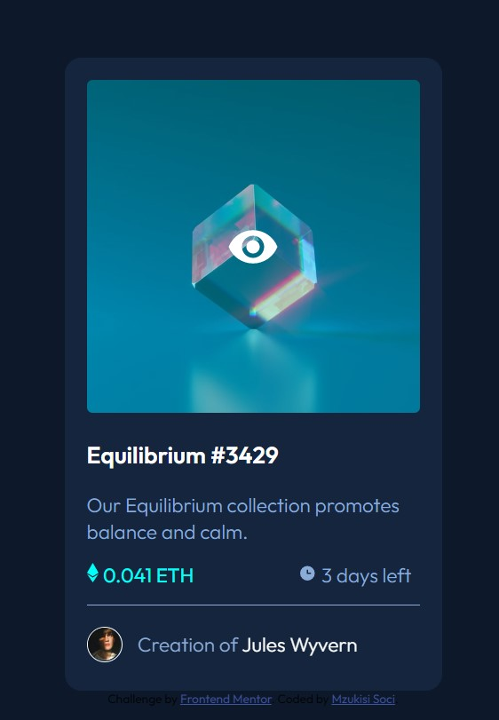
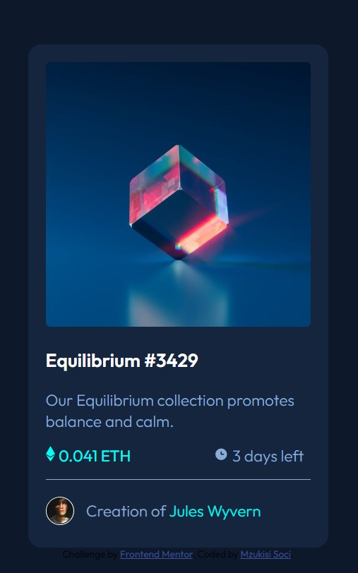

# Frontend Mentor - NFT preview card component solution

This is a solution to the [NFT preview card component challenge on Frontend Mentor](https://www.frontendmentor.io/challenges/nft-preview-card-component-SbdUL_w0U). Frontend Mentor challenges help you improve your coding skills by building realistic projects.

## Table of contents

- [Overview](#overview)
  - [The challenge](#the-challenge)
  - [Screenshot](#screenshot)
  - [Links](#links)
- [My process](#my-process)
  - [Built with](#built-with)
  - [What I learned](#what-i-learned)
  - [Continued development](#continued-development)
  - [Useful resources](#useful-resources)
- [Author](#author)
- [Acknowledgments](#acknowledgments)

## Overview

Demonstrate ability to create a web page without tutorial instruction. The coding challenge is provided by Frontend Mentor.

### Screenshot

## My process

- Linked CSS sheet externally
- Applied background color
- Created div with white background
- Nested image and added tags for heading and paragraphs
- Added appropriate classes
- Applied styling as specified in style guide
- Added appropriate styling for active states

### Built with

- Semantic HTML5 markup
- CSS custom properties

### What I learned

I learned how to use html to structure content and CSS to apply styling on the one page website without tutorial instruction.

Applied HTML.
- HTML tags, attributes, boilerplates, images, paragraphs, headings and anchors and structure.

Applied CSS:
- External CSS
- CSS Syntax, Selectors, Classes and IDs
- Divs
- Active states for hover animation.

### Continued development

I still have to learn and apply media queries on this page.

### Useful resources

- [MDN Web docs - HTML](https://developer.mozilla.org/en-US/docs/Web/HTML) - This has information to understand html.
- [MDN Web docs - CSS](https://developer.mozilla.org/en-US/docs/Web/CSS) - This has information to understand CSS.
- [W3Schools HTML Tutorial](https://www.w3schools.com/html/) - This has information to understand html.
- [W3Schools CSS Tutorial](https://www.w3schools.com/css/) - This has information to understand CSS.

## Author

- LinkedIn - [Mzukisi Soci](https://www.linkedin.com/in/mzukisi-soci-308521140/)
